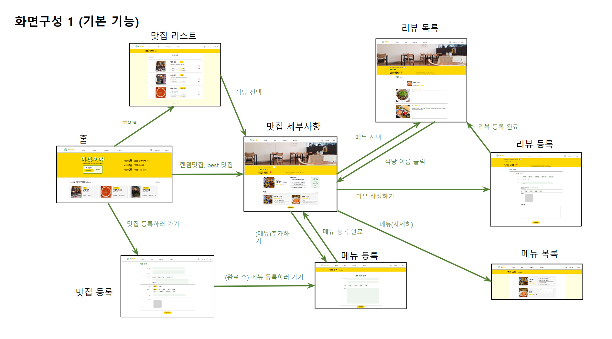
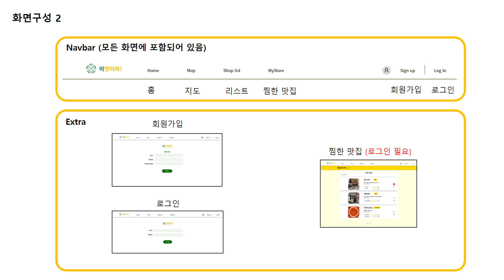

# 🟡E_masiya
이맛이야 - 이화여대 주변 맛집 정보 웹  
http://plammet.pythonanywhere.com/
---

### 프로젝트 계획 이유
코로나로 인해 이화사이버캠퍼스를 다닌 지 2년이 되었고, 학교 주변 맛집에 대한 정보를 찾기 어려운 점을 많이 느꼈습니다. 
이에 학교 재학생들이 풍부한 먹거리와 함께 행복한 학교생활을 하는 바람에서 맛집 추천 웬사이트 프로젝트를 기획하게 되었습니다.

---
### 개발기간
2022.09.06 ~ 2022.12.20

---
### 개발 환경
- goormide
- Flask
- firebase
- HTML , CSS, JS

---

### E_masiya 프로젝트 기능 설명

1. 맛집 등록 기능
    - shop_upload.html
    - 가게 이름, 주소, 카테고리 등 입력

2. 맛집 메뉴 등록 기능
    - menu_upload.html
    - 메뉴 이름, 가격, 이미지 등 입력

3. 리뷰 작성 기능
    - review_upload.html
    - 등록된 메뉴에 대해 리뷰 작성 가능
    - 소요 시간, 별점 등 입력

4.  회원가입, 로그인, 로그아웃
    - signup.html, login.html
    - 로그인 후 찜하기 기능 이용 가능

5. 맛집 찜하기 기능(북마크)
    - 로그인 후 맛집 리스트 페이지에서 하트 이미지 클릭
    - 이후 my_store.html 페이지에서 찜한 맛집 확인 가능

6. 맛집 리스트 제공
    - list.html

7. 랜덤 맛집 추천 기능
    - main.html 페이지 상단에서 이용 가능

---

### 기여할 수 있는 방법(Contributing)
- pullrequest를 보내주세요.
- (https://github.com/Plammet/E_masiya) 를 포크하세요.
